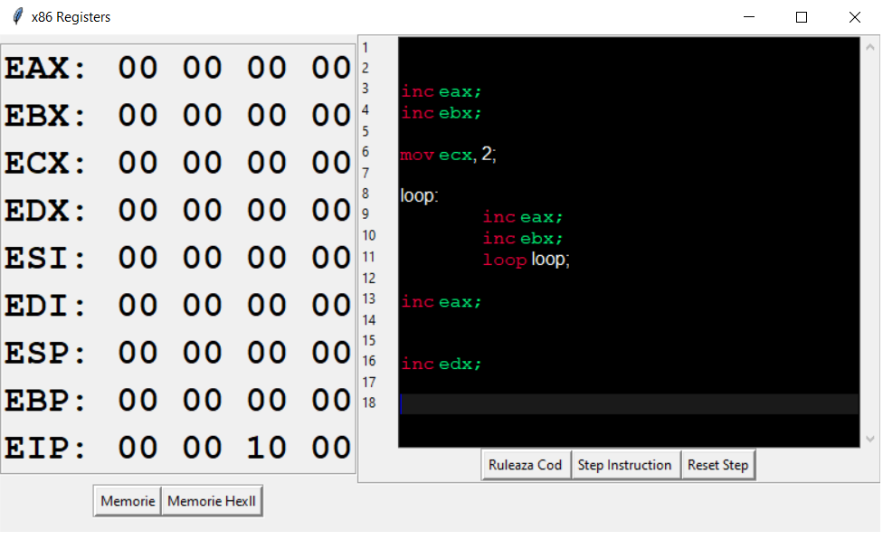

# Simple Instruction Simulator


## Project Objective:
Simulation of assembly instructions on an x86 32bit architecture with easy to use user interface.
## Functionalities:
- General-purpose register easy access in the main panel of the simulator
- Running x86 32bit assembly code
    - step by step 
    - entire asm code at once 
- Memory view: hexll and side by side view (It allows the user to easily read the memory contents)
- syntax highlighting for the ISA (PS: for more instruction highlighting just edit the ISA.txt file with the instructions you want to be highlighted)


## Core Modules:
- [Unicorn](https://www.unicorn-engine.org/)
- [Keystone](https://www.keystone-engine.org/)
- [Tkinter](https://docs.python.org/3/library/tkinter.html)

## Installation:

Be sure you have Python installed, then run the following commands to install the core modules used in this project: </br>
```
   pip install unicorn   - for UNICORN engine 
   pip install keystone  - for KEYSTONE engine
   pip install tk        - for GUI engine
```
You may need to install additional modules needed by the core modules mentioned above. <br>
If you want to have the same setup I used to test the application on another device you can run the following command in the terminal:
```
pip install -r requirements.txt  
```
For problems when installing any of the modules required by Keystone, use the following [resource](https://www.lfd.uci.edu/~gohlke/pythonlibs/) for the compiled version of the module. 
# The SIMULATOR

The main pannel <br>


Step Simulation Example <br>


Hexll Memory Format <br>


# Implementation details

## Millstones

- Setting up the unicorn-keystone-Tkinter environment 
    - Problems:
        - Combining keystone and unicorn for easy assembling and testing of asm code 
- Adding memory viewing interface
    - Problems:
        - formating the memory in such a way that the user could read the data was a challenge at first
        - aligning memory cells 
        - adding hexll format to the memory while keeping the structure mostly the same
- Step by step running mode
    - Problems:
        - Memory:
            - This was by far the most challenging part of the project, after I added this functionality I had problems with the regular running mode while displaying the memory because it tried to update at each memory access and it. 
            - To solve this problem I choose to update the memory only while doing step by step simulation and just add a button for memory updates that the user can click and instantly update the memory.
        - Step by step Highlight:
            - It was hard at first to think of a way to map each line of code to a memory address as keystone doesn't provide a memory address instruction mapping
            - To create this mapping I had to assemble each line of code on its own and create the memory mapping in this way. After I had the memory - instruction map it was easy to map the program lines to the memory and after that highlight the lines 

## Similar projects:
1. [Carlosrafaelgn’s simulator](https://carlosrafaelgn.com.br/asm86/) - allows the simulation of x86 assembly instructions, easy registers, and flags values access. The code runs without letting the user do a step by step simulation.
2. [Davis simulator](https://kobzol.github.io/davis/) - allows the simulation of an entire assembly program along with a nice registers values viewing interface, flags, RAM, and the possibility to view memory by blocks of 1, 2, or even 4 bytes.
3. [Schweigi’s simulator](https://schweigi.github.io/assembler-simulator/) - an 8-bit simulator, with a reduced number of general-purpose registers, but it offers the user the possibility to run instructions step-by-step along with step highlighting.
4. [Marss simulator](https://github.com/avadhpatel/marss)


For bug reports please feel free to email me at: necula.leonard.gabriel@gmail.com
